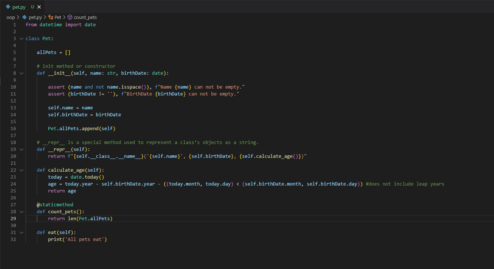

## Examples of Class & Constructor in Python

## Examples of @staticmethod and @classmethod in Python

## Examples of inheritance in Python

## Examples of Encapsulation / Getters & Setters / Read-Only Attribute / Private attribute in Python

## Examples of Encapsulation

## Examples of Abstraction

## Examples of Polymorphism

